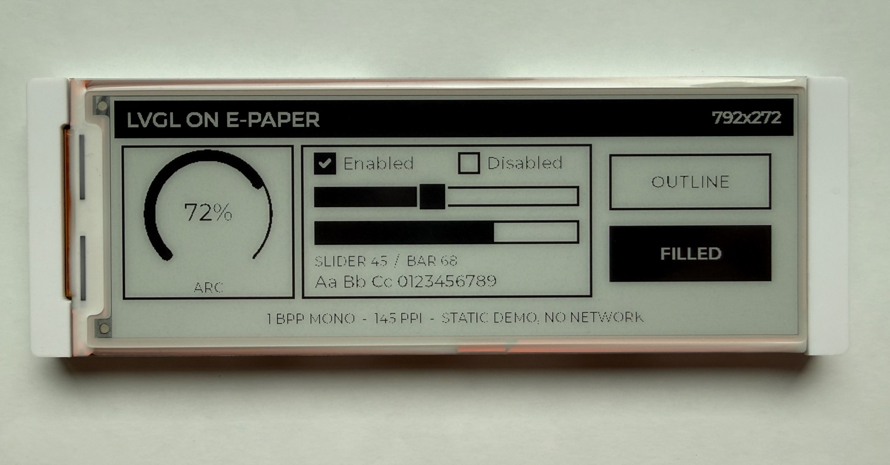
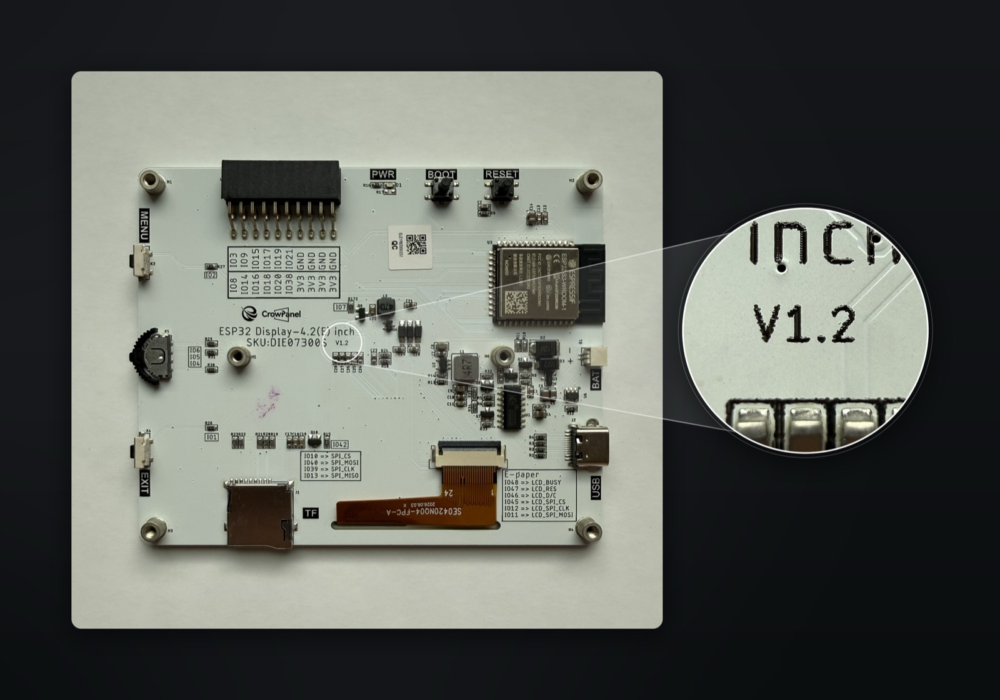
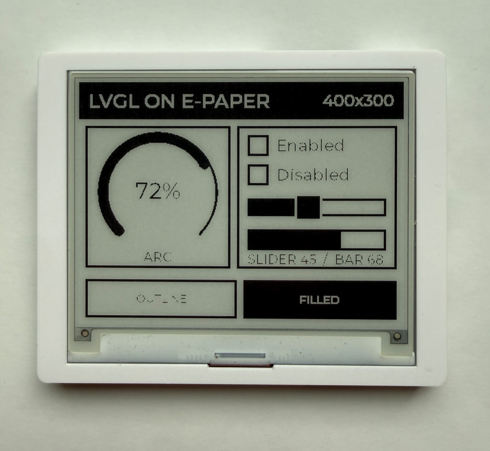

# ESPHome CrowPanel E-Paper component



ESPHome external component for the Elecrow CrowPanel 4.2" and 5.79" e-paper
displays, built for LVGL.

Covers all three panel variants, including the 4.2" v1.2 revision. Partial
refresh works on every model, so LVGL redraws stay fast instead of flashing the
whole screen on each update.

> [!NOTE]
> **[Reverse-engineering the CrowPanel e-paper series](#)** - the full write-up
> on how these panels work, the two 4.2" revisions, and what it took to get
> partial refresh going on each. *Coming soon.*

## Supported models

| `model` | Panel | Resolution | Controller |
|---------|-------|------------|------------|
| `4.20in` | [4.2"](https://tidd.ly/47KJCfp) v1.0 | 400x300 | SSD1683 |
| `4.20in-v1.2` | [4.2"](https://tidd.ly/47KJCfp) v1.2 | 400x300 | UC8276C |
| `5.79in` | [5.79"](https://tidd.ly/3P52UWy) | 792x272 | dual SSD1683 (cascade) |

Both 4.2" revisions do partial refresh. The SSD1683 takes its waveforms from
OTP; the UC8276C has none programmed, so the driver uploads Elecrow's GC (full)
and DU (partial) tables to the controller instead.

> [!WARNING]
> **The 4.2" ships in two revisions under the same SKU.** Elecrow changed the
> controller from SSD1683 to UC8276C in v1.2 without changing the product
> listing, and the two need different drivers. Pick the wrong `model` and the
> panel comes up blank or garbled.

### Which 4.2" revision do I have?

Open the case and read the silkscreen next to the SKU. It prints either **V1.0**
or **V1.2**, and that is the only reliable answer - the revision is not on the
box, the listing, or the outside of the case.



*Printed right after `SKU:DIE07300S` - this board is a V1.2.*

Then set `model: "4.20in"` for V1.0, or `model: "4.20in-v1.2"` for V1.2.

Elecrow's own example repo tells the two apart by a green circular sticker on
the back of the board, and you will see that repeated elsewhere. Treat it as a
hint at best - v1.2 boards also ship without the sticker. If you are buying now
you will most likely get a v1.2, so if `4.20in` comes up blank or garbled, try
`4.20in-v1.2`.

## Setup

```yaml
external_components:
  - source: github://ESPBoards/esphome-lvgl-crowpanel-epaper-5.79-4.2
```

Or point at a local checkout. The path is resolved relative to the directory
holding your YAML, so the examples in `examples/` use `../components`:

```yaml
external_components:
  - source: ../components
```

```yaml
display:
  - platform: crowpanel_epaper
    id: epd
    model: "5.79in"
    clk_pin: 12
    mosi_pin: 11
    cs_pin: 45
    dc_pin: 46
    reset_pin: 47
    busy_pin: 48
    invert_colors: true
    full_update_every: 10
    update_interval: 60s
```

GPIO 7 powers the display and needs to be high before anything works:

```yaml
switch:
  - platform: gpio
    pin: 7
    id: epd_power
    restore_mode: ALWAYS_ON
    internal: true
```

## With LVGL



Since this component supports LVGL, you can use the [ESPHome LVGL Designer](https://www.espboards.dev/tools/esphome-lvgl-designer/) to visually design your UI.

```yaml
display:
  - platform: crowpanel_epaper
    id: epd
    model: "5.79in"
    clk_pin: 12
    mosi_pin: 11
    cs_pin: 45
    dc_pin: 46
    reset_pin: 47
    busy_pin: 48
    invert_colors: true
    full_update_every: 9999
    auto_clear_enabled: false
    update_interval: never

lvgl:
  displays: epd
  buffer_size: 25%
  color_depth: 16
  on_draw_end:
    component.update: epd
```

## Options

| Option | Default | Description |
|--------|---------|-------------|
| `model` | required | See [Supported models](#supported-models). |
| `full_update_every` | `10` | Full refresh every N updates. Partial refresh is faster but ghosts over time. |
| `invert_colors` | `false` | Needed on the 5.79" panel. Both 4.2" revisions are correct without it - `4.20in-v1.2` inverts in the driver, since the UC8276C renders a set bit black. |
| `rotation` | `0` | 0, 90, 180, or 270. |
| `auto_clear_enabled` | `true` | Turn off when using LVGL. |
| `update_interval` | `60s` | Set to `never` when using LVGL. |

To force a full refresh (e.g. on button press to clear ghosting):

```yaml
- lambda: 'id(epd).force_full_update();'
- component.update: epd
```

## Credits

- [semvis123](https://github.com/semvis123) for the
  [original component](https://github.com/semvis123/esphome-crowpanel-4.2-epaper)
  this one started from
- [siku2](https://github.com/siku2) for the
  [5.79" dual-controller support](https://github.com/semvis123/esphome-crowpanel-4.2-epaper/commit/e51802cef23d0d1ff178cbfbe91ee3d22aecf1f2)
- Elecrow, for publishing the
  [demo drivers](https://github.com/Elecrow-RD/CrowPanel-ESP32-4.2-E-paper-HMI-Display-with-400-300)
  the UC8276C waveform tables come from
