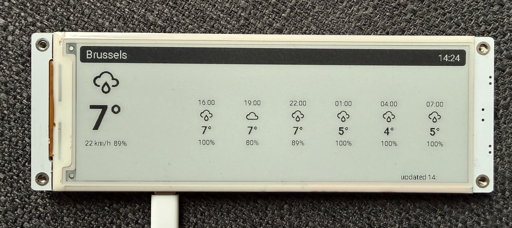
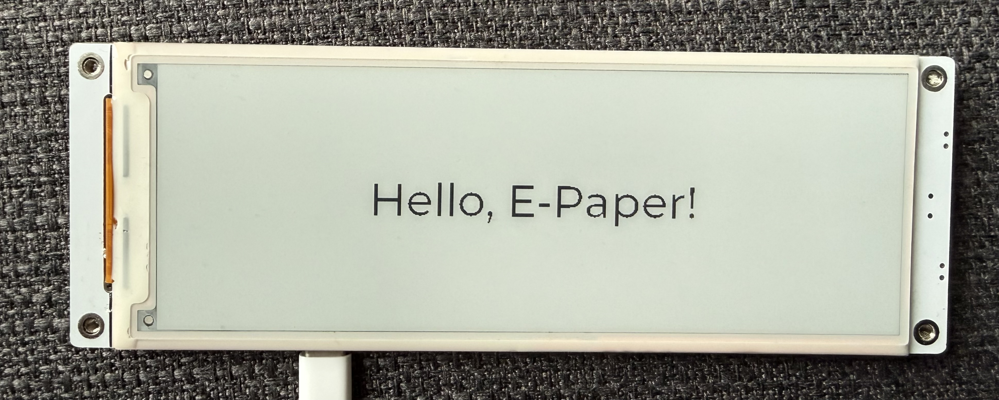

# ESPHome CrowPanel E-Paper component



ESPHome external component for the Elecrow CrowPanel 4.2" and 5.79" e-paper displays. The main reason this exists is that the [semvis123 component](https://github.com/semvis123/esphome-crowpanel-4.2-epaper) (which already has great 5.79" support from [siku2](https://github.com/semvis123/esphome-crowpanel-4.2-epaper/commit/e51802cef23d0d1ff178cbfbe91ee3d22aecf1f2)) didn't work with LVGL. This one does.

Supported models: [`4.20in`](https://tidd.ly/47KJCfp) (400x300) and [`5.79in`](https://tidd.ly/3P52UWy) (792x272).

## Setup

```yaml
external_components:
  - source: components
```

```yaml
display:
  - platform: crowpanel_epaper
    id: epd
    model: "5.79in"
    clk_pin: 12
    mosi_pin: 11
    cs_pin: 45
    dc_pin: 46
    reset_pin: 47
    busy_pin: 48
    invert_colors: true
    full_update_every: 10
    update_interval: 60s
```

GPIO 7 powers the display and needs to be high before anything works:

```yaml
switch:
  - platform: gpio
    pin: 7
    id: epd_power
    restore_mode: ALWAYS_ON
    internal: true
```

## With LVGL



Since this component supports LVGL, you can use the [ESPHome LVGL Designer](https://www.espboards.dev/tools/esphome-lvgl-designer/) to visually design your UI.

```yaml
display:
  - platform: crowpanel_epaper
    id: epd
    model: "5.79in"
    clk_pin: 12
    mosi_pin: 11
    cs_pin: 45
    dc_pin: 46
    reset_pin: 47
    busy_pin: 48
    invert_colors: true
    full_update_every: 9999
    auto_clear_enabled: false
    update_interval: never

lvgl:
  displays: epd
  buffer_size: 25%
  color_depth: 16
  on_draw_end:
    component.update: epd
```

## Options

| Option | Default | Description |
|--------|---------|-------------|
| `model` | required | `"4.20in"` or `"5.79in"` |
| `full_update_every` | `10` | Full refresh every N updates. Partial refresh is faster but ghosts over time. |
| `invert_colors` | `false` | Needed on the 5.79" panel. |
| `rotation` | `0` | 0, 90, 180, or 270. |
| `auto_clear_enabled` | `true` | Turn off when using LVGL. |
| `update_interval` | `60s` | Set to `never` when using LVGL. |

To force a full refresh (e.g. on button press to clear ghosting):

```yaml
- lambda: 'id(epd).force_full_update();'
- component.update: epd
```

## Credits

- [semvis123](https://github.com/semvis123) for the original component
- [siku2](https://github.com/siku2) for the 5.79" dual-controller support
